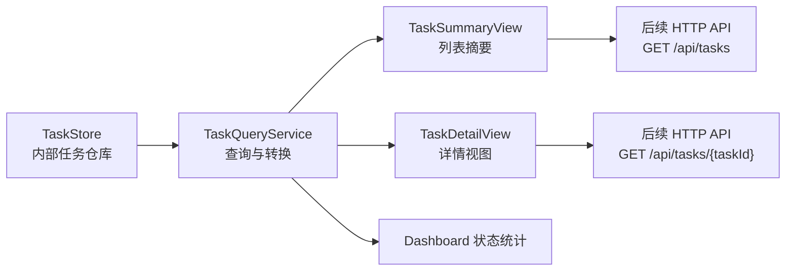

# 第22课：任务结果查询与任务管理服务

---

## 一、本课目标

前面第18到21课，我们已经把最小任务闭环跑通了：

```text
Client 提交 TASK_SUBMIT
Controller 创建任务并选择 Worker
Worker 执行任务
Worker 返回 TASK_RESULT
Controller 回收结果并写回 TaskStore
Controller 再把结果返回给 Client
```

现在系统还有一个明显缺口：

```text
任务已经执行完了，但外部还没有一个清晰的查询入口。
```

也就是说，现在任务结果虽然保存在 `TaskStore` 里，但后续如果要做 HTTP API、Dashboard、任务历史页面、排查失败原因，都不应该让外部直接拿 `TaskMetadata` 这个内部对象。

本课要补的是 Controller 侧的任务查询与管理服务：

```text
TaskStore 内部数据
    -> TaskQueryService 查询服务
    -> TaskSummaryView / TaskDetailView 对外展示模型
    -> 后续 HTTP API / Dashboard / 测试复用
```

完成后，你应该能通过 Java API 查询：

```text
某个 taskId 的完整详情
全部任务列表
某个状态下的任务列表
各状态任务数量统计
任务是否成功、失败原因、执行 Worker、耗时、重试次数
```

---

## 二、为什么要单独做查询服务

你可能会想：

```java
taskStore.get(taskId)
taskStore.listAll()
taskStore.listByStatus(status)
```

这些方法不是已经有了吗？为什么还要再包一层 `TaskQueryService`？

原因是：`TaskStore` 是存储层，`TaskQueryService` 是业务查询层。

二者职责不一样：

| 层 | 负责什么 | 不应该负责什么 |
|----|----------|----------------|
| `TaskStore` | 保存和读取任务原始状态 | 面向页面/API 组织展示字段 |
| `TaskQueryService` | 按业务语义查询、过滤、转换 | 直接维护底层 Map 或数据库 |
| `TaskView` | 对外展示稳定结构 | 暴露内部可变对象 |

`TaskMetadata` 是系统内部的生命周期记录，里面包含 `TaskRequest`、`TaskResult`、`attemptedWorkers` 等对象。后续如果 HTTP API 直接返回它，会有几个问题：

```text
1. 内部字段会全部暴露出去，不利于接口稳定
2. 后续 TaskMetadata 改字段时，外部 API 也会跟着震荡
3. Dashboard 只想看摘要信息，不应该拿一大坨内部对象
4. 查询时需要计算 durationMs、hasResult、statusCount 这类派生字段
```

所以主流项目里常见做法是：

```text
内部 Entity / Metadata
    -> Service 层转换
    -> DTO / View / Response
```

在我们这个项目里，先不引入复杂 Web 框架，先用普通 Java 类把这层边界打清楚。

---

## 三、本课你要新增的文件

核心代码你来手敲：

| 文件 | 作用 |
|------|------|
| `heteromesh-controller/src/main/java/com/heteromesh/controller/task/TaskSummaryView.java` | 任务列表页使用的摘要视图 |
| `heteromesh-controller/src/main/java/com/heteromesh/controller/task/TaskDetailView.java` | 单个任务详情页使用的完整视图 |
| `heteromesh-controller/src/main/java/com/heteromesh/controller/task/TaskQueryService.java` | Controller 侧任务查询服务 |

我后面会补测试：

| 文件 | 测试什么 |
|------|----------|
| `heteromesh-controller/src/test/java/com/heteromesh/controller/task/TaskQueryServiceTest.java` | 查询单个任务、列表、状态过滤、状态统计、缺失任务异常 |

---

## 四、第一步：设计 TaskSummaryView

`TaskSummaryView` 是给任务列表用的。

列表页不需要展示所有输入输出，只需要能快速扫一眼：

```text
任务 ID
任务类型
当前状态
分配到哪个 Worker
重试次数
创建时间
更新时间
是否已有结果
```

建议包名：

```java
package com.heteromesh.controller.task;
```

参考结构：

```java
@Data
@NoArgsConstructor
@AllArgsConstructor
public class TaskSummaryView {
    private String taskId;
    private String taskType;
    private TaskStatus status;
    private String assignedWorkerId;
    private int retryCount;
    private long createdAt;
    private long updatedAt;
    private boolean hasResult;
}
```

注意这里放 `taskType`，是因为后续 Dashboard 会需要区分：

```text
TEXT_GENERATION
IMAGE_INFERENCE
VIDEO_TRANSCODE
EMBEDDING
```

---

## 五、第二步：设计 TaskDetailView

`TaskDetailView` 是给单个任务详情用的。

它应该比摘要多展示：

```text
任务输入 payload
资源需求 resourceRequirements
尝试过哪些 Worker
最终输出 output
失败原因 errorMessage
开始时间 startedAt
结束时间 finishedAt
执行耗时 durationMs
```

参考结构：

```java
@Data
@NoArgsConstructor
@AllArgsConstructor
public class TaskDetailView {
    private String taskId;
    private String taskType;
    private String payload;
    private Map<String, String> resourceRequirements;
    private TaskStatus status;
    private String assignedWorkerId;
    private int retryCount;
    private List<String> attemptedWorkers;
    private long createdAt;
    private long updatedAt;
    private String output;
    private String errorMessage;
    private long startedAt;
    private long finishedAt;
    private long durationMs;
}
```

这里有一个设计点：

```text
durationMs 不直接存在 TaskMetadata 里，而是由 TaskResult 的 startedAt / finishedAt 计算出来。
```

也就是：

```java
long durationMs = 0;
if (result != null && result.getFinishedAt() > result.getStartedAt()) {
    durationMs = result.getFinishedAt() - result.getStartedAt();
}
```

这样设计的好处是：

```text
TaskMetadata 继续负责记录事实
TaskDetailView 负责组织展示需要的派生字段
```

---

## 六、第三步：设计 TaskQueryService

新建：

```text
heteromesh-controller/src/main/java/com/heteromesh/controller/task/TaskQueryService.java
```

它持有一个 `TaskStore`：

```java
public class TaskQueryService {
    private final TaskStore taskStore;

    public TaskQueryService(TaskStore taskStore) {
        this.taskStore = taskStore;
    }
}
```

本课建议实现 4 个公开方法：

```java
public TaskDetailView getTask(String taskId)

public List<TaskSummaryView> listAll()

public List<TaskSummaryView> listByStatus(TaskStatus status)

public Map<TaskStatus, Long> countByStatus()
```

这 4 个方法分别对应后续 HTTP API：

```text
GET /api/tasks/{taskId}
GET /api/tasks
GET /api/tasks?status=RUNNING
GET /api/tasks/statistics
```

---

## 七、第四步：实现 getTask

`getTask` 的语义是：

```text
根据 taskId 查询任务详情。
任务不存在时，抛出清晰异常。
```

参考写法：

```java
public TaskDetailView getTask(String taskId) {
    TaskMetadata metadata = taskStore.get(taskId)
            .orElseThrow(() -> new IllegalArgumentException("Task not found: " + taskId));

    return toDetailView(metadata);
}
```

为什么这里可以抛 `IllegalArgumentException`？

因为当前还没有 HTTP 层，先用 Java 异常表达：

```text
调用方传入了不存在的 taskId，这是参数语义错误。
```

等后续接 HTTP API 时，我们再把它转换成：

```text
HTTP 404 Not Found
```

---

## 八、第五步：实现列表查询

`listAll` 很直接：

```java
public List<TaskSummaryView> listAll() {
    return taskStore.listAll().stream()
            .map(this::toSummaryView)
            .toList();
}
```

`listByStatus` 也类似：

```java
public List<TaskSummaryView> listByStatus(TaskStatus status) {
    return taskStore.listByStatus(status).stream()
            .map(this::toSummaryView)
            .toList();
}
```

注意：这里返回的是 `TaskSummaryView`，不是 `TaskMetadata`。

这个边界非常重要，后面面试可以这样讲：

```text
TaskStore 返回内部模型，TaskQueryService 负责转换成面向接口和页面的只读视图。
这样可以避免外部直接依赖内部任务生命周期对象。
```

---

## 九、第六步：实现状态统计

`countByStatus` 用来给 Dashboard 做基础数据：

```text
SUBMITTED 有多少
DISPATCHING 有多少
RUNNING 有多少
SUCCEEDED 有多少
FAILED 有多少
TIMEOUT 有多少
CANCELED 有多少
```

参考写法：

```java
public Map<TaskStatus, Long> countByStatus() {
    Map<TaskStatus, Long> result = new EnumMap<>(TaskStatus.class);

    for (TaskStatus status : TaskStatus.values()) {
        result.put(status, 0L);
    }

    for (TaskMetadata metadata : taskStore.listAll()) {
        TaskStatus status = metadata.getStatus();
        result.put(status, result.get(status) + 1);
    }

    return result;
}
```

这里推荐使用 `EnumMap`，原因是：

```text
key 是 enum 时，EnumMap 比 HashMap 更贴合语义，也更轻量。
```

这不是必须，但属于面试里能顺手讲出来的工程细节。

---

## 十、第七步：写两个转换方法

`TaskQueryService` 内部建议写两个 private 方法：

```java
private TaskSummaryView toSummaryView(TaskMetadata metadata)

private TaskDetailView toDetailView(TaskMetadata metadata)
```

`toSummaryView` 做摘要转换：

```java
private TaskSummaryView toSummaryView(TaskMetadata metadata) {
    TaskRequest request = metadata.getRequest();

    return new TaskSummaryView(
            metadata.getTaskId(),
            request.getTaskType(),
            metadata.getStatus(),
            metadata.getAssignedWorkerId(),
            metadata.getRetryCount(),
            metadata.getCreatedAt(),
            metadata.getUpdatedAt(),
            metadata.getResult() != null
    );
}
```

`toDetailView` 做完整转换。

你写的时候要特别注意 `result == null` 的情况：

```text
任务刚提交、正在调度、正在执行时，可能还没有 TaskResult。
```

所以不要直接：

```java
metadata.getResult().getOutput()
```

要先判断：

```java
TaskResult result = metadata.getResult();

String output = result == null ? null : result.getOutput();
String errorMessage = result == null ? null : result.getErrorMessage();
long startedAt = result == null ? 0 : result.getStartedAt();
long finishedAt = result == null ? 0 : result.getFinishedAt();
```

`attemptedWorkers` 建议复制一份：

```java
new ArrayList<>(metadata.getAttemptedWorkers())
```

不要直接把内部 List 暴露出去。

这个点很关键：

```text
如果 View 直接持有 metadata.getAttemptedWorkers() 原始 List，
外部拿到 View 后可能修改它，等于绕过 TaskStore 改了内部状态。
```

---

## 十一、本课完成后的结构图



---

## 十二、你写完后应该满足的检查点

本课写完后，应该满足：

- `TaskQueryService` 只依赖 `TaskStore`
- `getTask(taskId)` 能返回完整详情
- `getTask(taskId)` 查询不存在任务时，有清晰异常
- `listAll()` 返回所有任务摘要
- `listByStatus(status)` 返回指定状态任务摘要
- `countByStatus()` 返回每种 `TaskStatus` 的数量
- `TaskSummaryView` 不暴露任务输入输出大字段
- `TaskDetailView` 能展示 result 里的输出、错误和耗时
- 任务没有 result 时不会空指针
- `attemptedWorkers` 对外返回副本，不暴露内部可变 List

---

## 十三、我后面会补的测试

你写完后，我会补：

```text
TaskQueryServiceTest
```

测试会覆盖：

```text
1. 创建任务后，getTask 能查到 taskId、taskType、payload
2. 没有结果的任务，detail 里的 output/errorMessage 为空，durationMs 为 0
3. 完成成功任务后，getTask 能看到 output、workerId、durationMs
4. listAll 能返回多个任务摘要
5. listByStatus 只返回对应状态任务
6. countByStatus 会包含所有 TaskStatus，即使数量为 0
7. 查询不存在 taskId 会抛出 IllegalArgumentException
8. 修改 TaskDetailView.attemptedWorkers 不会污染 TaskMetadata 内部列表
```

---

## 十四、这节课写完后你要能讲清楚

这一课不是为了炫复杂度，而是为了建立一个很重要的工程边界：

```text
存储层保存内部事实
查询服务组织业务视图
对外接口返回稳定 DTO
```

面试官如果问：

```text
为什么不直接把 TaskMetadata 返回给前端？
```

你可以回答：

```text
TaskMetadata 是内部生命周期对象，字段会随着调度、重试、持久化不断演进。
如果直接暴露给外部，后续内部改动会破坏 API 稳定性。
所以我在 Controller 侧加了 TaskQueryService，把内部模型转换成 TaskSummaryView 和 TaskDetailView。
列表接口返回轻量摘要，详情接口返回完整视图，同时对 attemptedWorkers 这种可变集合做副本保护。
```

这就是这节课的核心价值。

