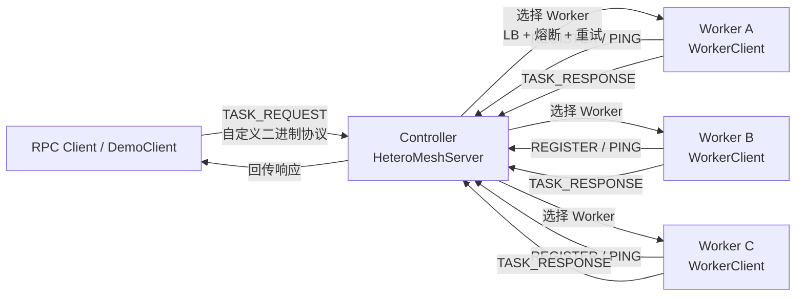
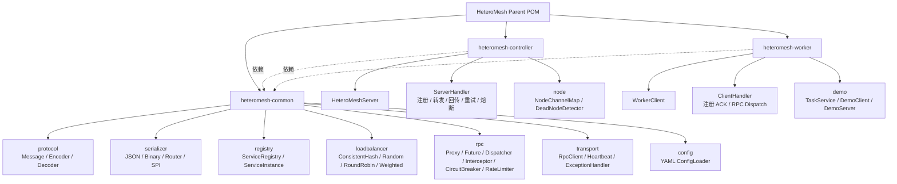
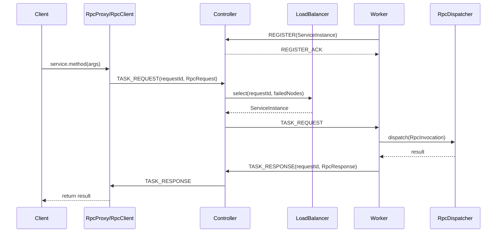

# HeteroMesh

HeteroMesh 是一个从零实现的 Java 分布式 RPC 与节点调度学习项目。当前版本已经完成自定义二进制协议、Netty 长连接、SPI 插件加载、序列化策略路由、节点注册与心跳、四种负载均衡、动态代理 RPC、超时清理、重试、熔断和基础限流组件。

项目的长期目标是演进为“异构 GPU 集群推理调度系统”。当前更准确的定位是：

> 一个可运行、可测试、可继续扩展的自研 RPC 框架 + Controller/Worker 节点路由原型。

## 当前状态

最后验证时间：2026-06-04

```text
mvn test
BUILD SUCCESS
Tests run: 193, Failures: 0, Errors: 0, Skipped: 0
```

已完成：

| 能力 | 当前实现 |
|------|----------|
| 自定义协议 | 11 字节固定头：Magic(4) + Version(1) + SerializerCode(1) + Type(1) + Length(4) |
| 网络通信 | Netty Server/Client，LengthFieldBasedFrameDecoder 处理半包/粘包 |
| 序列化 | JSON(Gson) + Binary，两者通过 SPI 加载 |
| 序列化路由 | 按 MessageType 从 YAML 选择序列化器 |
| 注册中心 | Worker 主动 REGISTER，Controller 维护 ServiceInstance |
| 心跳与下线 | IdleStateHandler + HeartbeatHandler + DeadNodeDetector |
| 负载均衡 | consistentHash / random / roundRobin / weighted，支持 SPI 切换 |
| RPC 调用 | JDK 动态代理 + RpcInvocation + RpcDispatcher + RpcFuture |
| 容错 | Controller 转发重试、失败节点排除、三态熔断器 |
| 限流 | TokenBucketRateLimiter、SlidingWindowRateLimiter 已实现，尚未接入主链路 |
| 测试 | 单元测试、集成测试、基础压力测试，共 193 个测试通过 |

规划中，尚未完成：

| 能力 | 状态 |
|------|------|
| HTTP REST API | 未实现 |
| Dashboard / WebSocket 监控 | 未实现 |
| 真实 GPU 推理执行器 | 未实现 |
| 任务状态机与任务调度器 | 未实现 |
| ChannelPool 连接池 | 未实现 |
| Kryo 序列化器 | 未实现 |
| Docker Compose 集群部署 | 未实现 |

## 架构图

### 当前运行架构



### 代码模块关系



### RPC 调用链路



## 协议设计

HeteroMesh 使用固定头 + 可变体的自定义二进制协议。

| 字段 | 长度 | 说明 |
|------|------|------|
| Magic | 4 bytes | 固定魔数 `0xCAFEBABE` |
| Version | 1 byte | 协议版本，当前 `0x01` |
| SerializerCode | 1 byte | `json` 或 `binary` |
| Type | 1 byte | PING / PONG / REGISTER / TASK_REQUEST 等 |
| Length | 4 bytes | Body 长度 |
| Body | N bytes | 序列化后的 Message |

当前消息类型：

| MessageType | 说明 |
|-------------|------|
| PING / PONG | 心跳 |
| REGISTER / REGISTER_ACK | Worker 注册与确认 |
| TASK_REQUEST / TASK_RESPONSE | RPC 请求与响应 |

## 技术栈

| 层次 | 技术 |
|------|------|
| 语言 | Java 21 |
| 网络 | Netty 4.1.x |
| 构建 | Maven 多模块 |
| 序列化 | Gson、自研 Binary 编解码 |
| 配置 | SnakeYAML |
| 日志 | SLF4J + Logback |
| 测试 | JUnit 5、Netty EmbeddedChannel、集成测试 |
| 扩展机制 | 自研 `@SPI` + `META-INF/services` |

## 模块结构

```text
HeteroMesh
├── pom.xml
├── heteromesh-common
│   └── src/main/java/com/heteromesh
│       ├── config
│       ├── loadbalancer
│       ├── protocol
│       ├── registry
│       ├── rpc
│       ├── serializer
│       ├── spi
│       └── transport
├── heteromesh-controller
│   └── src/main/java/com/heteromesh/controller
│       ├── HeteroMeshServer.java
│       ├── ServerHandler.java
│       ├── CircuitBreakerManager.java
│       └── node
└── heteromesh-worker
    └── src/main/java/com/heteromesh
        ├── worker
        └── demo
```

## 快速开始

### 环境要求

- JDK 21
- Maven 3.9+
- Windows / macOS / Linux 均可

### 编译和测试

```bash
mvn clean test
```

如果使用 IntelliJ IDEA 自带 Maven，也可以在 IDEA Maven 面板运行 `test` 生命周期。

### 运行指定测试

```bash
# Worker 集成测试
mvn test -pl heteromesh-worker -Dtest=RpcProxyIntegrationTest

# 注册与负载均衡链路
mvn test -pl heteromesh-worker -Dtest=ConsistentHashIntegrationTest

# 基础压力测试
mvn test -pl heteromesh-worker -Dtest=StressTest

# 协议体积对比
mvn test -pl heteromesh-common -Dtest=ProtocolBenchmark
```

## 核心设计亮点

1. **自定义二进制协议**  
   不依赖 HTTP/gRPC，使用固定协议头承载序列化方式、消息类型和 body 长度。

2. **SPI 插件化**  
   序列化器和负载均衡器都通过 `@SPI` 与 `META-INF/services` 加载，支持配置切换。

3. **策略化负载均衡**  
   已实现一致性哈希、随机、轮询、加权四种策略。一致性哈希使用 `TreeMap` 哈希环和 150 个虚拟节点。

4. **异步 RPC 模型**  
   使用 `requestId + CompletableFuture` 匹配响应，避免阻塞 Netty I/O 线程。

5. **动态代理调用体验**  
   `RpcProxy` 使用 JDK Proxy，把接口方法调用转成 `RpcInvocation`，由 Worker 端反射执行。

6. **Controller/Worker 主动注册模型**  
   Worker 主动连 Controller 并注册，适合 Worker 在 NAT 后方的场景。

7. **容错链路初具雏形**  
   Controller 支持失败节点排除、有限重试、请求超时检测和三态熔断。

## 后续路线

下一阶段应优先把项目从“RPC 路由原型”推进成“任务调度系统”。

| 优先级 | 任务 | 目标 |
|--------|------|------|
| P0 | 协议防御增强 | 校验 magic/version/type/length，补非法包测试 |
| P0 | README 与实现持续对齐 | 避免把规划能力写成已完成 |
| P1 | 任务模型 | 新增 TaskRequest、TaskResult、TaskStatus、TaskMetadata |
| P1 | Controller 调度器 | 从 ServerHandler 中拆出 TaskScheduler |
| P1 | Worker 执行器 | 增加本地任务队列、执行线程池、状态回传 |
| P2 | HTTP API | 支持提交任务、查询任务、查看节点 |
| P2 | 可观测性 | 统计 QPS、平均延迟、P95/P99、成功率 |
| P2 | 异构调度 | 根据 gpuType、vramFree、load、weight 路由任务 |
| P3 | Dashboard / Docker / 真实推理 | 作为展示与部署增强 |

## 参考项目

HeteroMesh 是教学项目，不直接对标工业级产品，但借鉴了以下项目的设计思想：

| 领域 | 项目 | 借鉴点 |
|------|------|--------|
| RPC | Apache Dubbo | SPI、服务注册发现、负载均衡、RPC 调用模型 |
| RPC | SOFARPC | 拦截器链、连接管理、容错策略 |
| 分布式调度 | XXL-JOB | Controller/Worker 架构、任务路由、心跳维护 |
| 注册中心 | Nacos | 服务实例模型、健康检查 |
| 熔断限流 | Sentinel | 熔断状态机、滑动窗口、令牌桶思想 |
| 网络通信 | Netty | Pipeline、编解码器、长连接通信 |
| 推理调度 | vLLM | Worker 管理和推理调度思路 |
