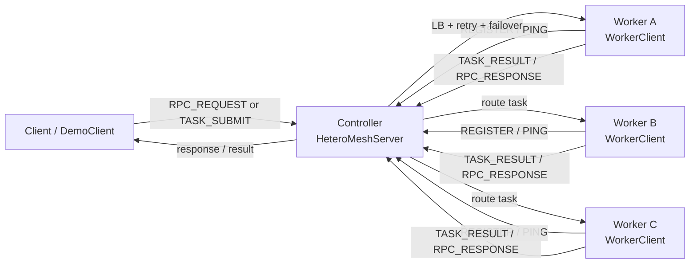
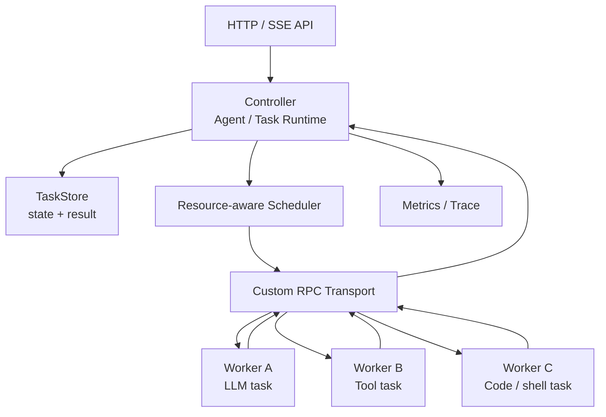

# HeteroMesh

HeteroMesh 是一个从零实现的 Java 分布式执行 Runtime 学习项目。

新的项目定位是：

> 面向 AI / Agent 任务的分布式执行与调度 Runtime 后端底座。

它不是一个 LangChain / CrewAI 这类 Agent 应用编排框架，也不是一个完整的大模型推理引擎。HeteroMesh 的重点是 Agent 或 AI 任务在真实系统中需要的后端基础设施：

- 自定义 RPC 通信
- Controller / Worker 节点治理
- 任务生命周期管理
- 调度、重试、超时、取消、终态保护
- 异构 Worker 资源上报与匹配
- Worker 执行队列、背压和故障转移
- HTTP / SSE 对外 API
- 指标、日志、压测和可观测性
- 轻量 LLM / Tool 任务接入，用来证明系统可以承载 Agent 执行

一句话：

```text
Agent 框架负责“想清楚下一步做什么”，HeteroMesh 负责“把这一步稳定地调度、执行、回收和观测”。
```

## 为什么和 AI Agent 有关

一个真实 Agent 不只是 prompt 和多轮对话。它通常还需要：

- 调用工具
- 执行代码
- 访问文件或外部服务
- 并发运行多个步骤
- 处理超时、失败、重试和取消
- 保存每一步状态
- 流式返回执行过程
- 控制 Worker 资源和执行权限
- 记录 trace、指标和错误

这些能力本质上是后端 Runtime 能力。HeteroMesh 当前的 RPC、任务调度、节点注册、心跳、负载均衡和容错机制，正是这类 Runtime 的底层骨架。

## 当前状态

历史验证记录：2026-06-04

```text
mvn test
BUILD SUCCESS
Tests run: 193, Failures: 0, Errors: 0, Skipped: 0
```

当前已完成或已有基础实现：

| 能力 | 当前实现 |
|------|----------|
| 自定义协议 | 11 字节固定头：Magic(4) + Version(1) + SerializerCode(1) + Type(1) + Length(4) |
| 网络通信 | Netty Server / Client，LengthFieldBasedFrameDecoder 处理半包和粘包 |
| 序列化 | JSON(Gson) + Binary，通过 SPI 加载 |
| 序列化路由 | 按 MessageType 从 YAML 选择序列化器 |
| 注册中心 | Worker 主动 REGISTER，Controller 维护 ServiceInstance |
| 心跳与下线 | IdleStateHandler + HeartbeatHandler + DeadNodeDetector |
| 负载均衡 | consistentHash / random / roundRobin / weighted，支持 SPI 切换 |
| RPC 调用 | JDK 动态代理 + RpcInvocation + RpcDispatcher + RpcFuture |
| RPC 容错雏形 | Controller 转发重试、失败节点排除、三态熔断器 |
| 限流组件 | TokenBucketRateLimiter、SlidingWindowRateLimiter 已实现，仍需接入主链路 |
| 任务模型 | TaskRequest、TaskResult、TaskStatus、TaskMetadata |
| 任务仓库 | InMemoryTaskStore，支持创建、查询、状态更新、结果写回 |
| 任务调度 | TaskScheduler、ScheduleResult，支持首次调度和重试调度雏形 |
| Worker 执行 | TaskExecutor、DefaultTaskExecutor，已能执行轻量 demo 任务并返回结果 |
| 任务查询 | TaskQueryService、TaskDetailView、TaskSummaryView |
| 任务超时 | TaskTimeoutManager，支持任务超时终态保护雏形 |

仍未完成或需要增强：

| 能力 | 状态 |
|------|------|
| Controller HTTP API | 未实现 |
| SSE / WebSocket 流式事件 | 未实现 |
| AgentRun / AgentStep / ToolCall 模型 | 未实现 |
| LLM / Tool 执行器 | 未实现 |
| Worker 本地队列与背压 | 未实现 |
| 资源感知调度 | 未实现 |
| 持久化 TaskStore | 未实现 |
| 指标系统与压测报告 | 未实现 |
| Docker Compose 多节点部署 | 未实现 |
| Dashboard | 未实现 |

## 当前架构



## 目标架构



## RPC 与 Agent Runtime 的分层

```text
RPC 层：
  解决一次远程调用如何发出去、如何匹配响应、如何超时和清理。

Task Runtime 层：
  解决一个任务从提交、调度、执行、回收、查询到失败恢复的生命周期。

Agent Runtime 层：
  解决一个 Agent run 拆成多个 step，每个 step 可能调用 LLM、工具、代码执行或外部服务。

HeteroMesh 当前已经有 RPC 层和 Task Runtime 雏形。
后续只需要轻量接入 AgentRun / AgentStep / ToolCall，就能把项目和 AI Agent 岗位连接起来。
```

## 技术栈

| 层次 | 技术 |
|------|------|
| 语言 | Java 21 |
| 网络 | Netty 4.1.x |
| 构建 | Maven 多模块 |
| 序列化 | Gson、自研 Binary 编解码 |
| 配置 | SnakeYAML |
| 日志 | SLF4J + Logback |
| 测试 | JUnit 5、Netty EmbeddedChannel、集成测试 |
| 扩展机制 | 自研 `@SPI` + `META-INF/services` |

## 快速开始

### 环境要求

- JDK 21
- Maven 3.9+
- Windows / macOS / Linux

### 编译和测试

```bash
mvn clean test
```

### 运行指定测试

```bash
# Worker 集成测试
mvn test -pl heteromesh-worker -Dtest=RpcProxyIntegrationTest

# 注册与负载均衡链路
mvn test -pl heteromesh-worker -Dtest=ConsistentHashIntegrationTest

# 基础压力测试
mvn test -pl heteromesh-worker -Dtest=StressTest

# 协议体积对比
mvn test -pl heteromesh-common -Dtest=ProtocolBenchmark
```

## 后续路线

近期主线不是做复杂 Agent 应用，而是把 HeteroMesh 做成能支撑 Agent 执行的后端底座。

| 阶段 | 目标 | 重点产出 |
|------|------|----------|
| 阶段一 | 任务调度闭环打磨 | 结果回收、查询、超时、取消、终态保护、任务级重试 |
| 阶段二 | RPC 与连接治理补强 | pending 清理、断线重连、错误码、限流熔断接入主链路 |
| 阶段三 | 异构 Worker 调度 | 资源上报、资源匹配、Worker 队列、背压 |
| 阶段四 | 对外 API 与流式事件 | HTTP API、SSE、任务事件流、Worker 查询 |
| 阶段五 | 轻量 AI / Agent 场景 | LLM_TASK、TOOL_TASK、简单 ToolRegistry |
| 阶段六 | 可观测性与工程化 | Metrics、trace、压测报告、Docker Compose、最终 README |

## 面试定位

简历上建议这样描述：

```text
HeteroMesh 是一个面向 AI / Agent 任务的分布式执行 Runtime。我从零实现了自定义 RPC 协议、Netty 长连接通信、Controller / Worker 节点治理、任务状态机、调度器、超时取消、任务级重试、故障转移和基础限流熔断。项目后续将接入资源感知调度、Worker 背压、HTTP/SSE API、指标系统和轻量 LLM/Tool 任务，用于支撑 Agent 执行链路。
```

面试时要讲清楚：

- RPC 如何设计，为什么需要 requestId
- 任务状态机如何保证合法流转
- Controller 如何维护 Worker 注册、心跳和下线
- 调度器如何选择 Worker
- 超时、取消、重试、后到结果如何处理
- Worker 满载时如何背压
- Agent step / tool call 为什么可以被抽象成分布式任务
- 项目目前还不是工业级 Agent 平台，差距在持久化、权限隔离、观测、评测和真实工具生态

## 参考方向

HeteroMesh 不直接对标工业级项目，但借鉴这些系统的思想：

| 方向 | 项目 | 参考点 |
|------|------|--------|
| RPC | Apache Dubbo / SOFARPC | SPI、服务注册发现、负载均衡、调用链治理 |
| 分布式调度 | XXL-JOB / PowerJob | Controller / Worker、任务路由、执行状态回收 |
| 熔断限流 | Sentinel | 熔断状态机、滑动窗口、令牌桶 |
| 分布式计算 | Ray | Task / Actor、资源调度、Worker 管理 |
| Agent Runtime | LangGraph / OpenHands / Dify | Agent step、工具执行、状态、流式事件、观测 |
| 推理调度 | vLLM | Worker 管理、资源利用、吞吐和延迟优化 |
